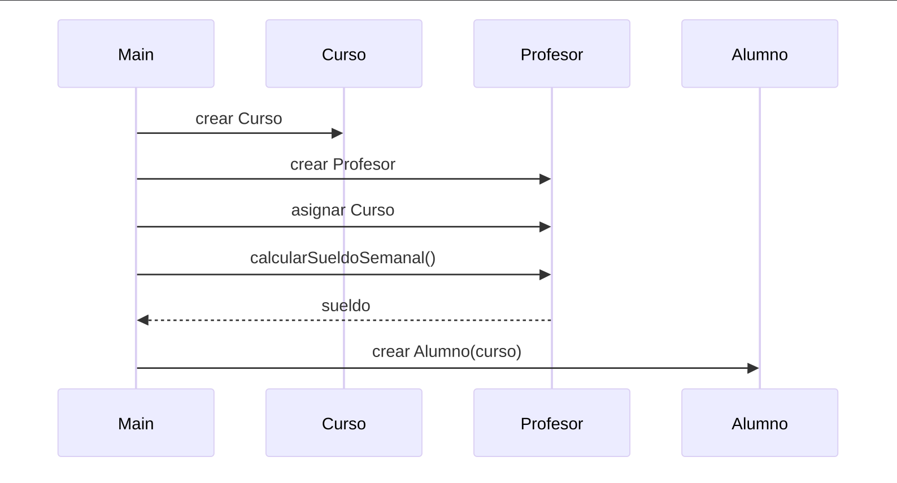

# Actividad 4:
### Introducción:
En este trabajo se desarrolla un pequeño sistema académico utilizando el paradigma de Programación Orientada a Objetos (POO) en Java. El sistema modela la relación entre un Curso, un Profesor y un Alumno, permitiendo registrar información básica y realizar cálculos como el total de créditos del curso y el sueldo semanal del profesor. La implementación se realizó utilizando tres clases principales, aplicando conceptos fundamentales como encapsulamiento, constructores, métodos y relaciones entre clases (composición y agregación). Además, el programa fue diseñado de forma interactiva mediante el uso de la clase Scanner, permitiendo que el usuario ingrese los datos dinámicamente desde teclado. Este proyecto simula un escenario real dentro del ámbito educativo y demuestra cómo la POO permite organizar y estructurar la información de manera clara y eficiente.
### Objetivo:
Desarrollar un programa en Java que implemente los principios básicos de la Programación Orientada a Objetos mediante la creación de tres clases: Curso, Profesor y Alumno, estableciendo relaciones entre ellas y permitiendo la captura interactiva de datos.

Asimismo, se busca:

* Aplicar el uso de constructores (vacío, con parámetros y copia).

* Implementar métodos para realizar cálculos (créditos totales y sueldo semanal).

* Utilizar agregación y composición dentro del modelado de clases.

* Hacer uso de la clase Scanner para crear un sistema dinámico e interactivo.

* Fortalecer la comprensión de la estructura y organización del código en Java.

### Tabla de relaciones:
| Clase A | Clase B | Tipo de relacion | Descripcion |
| --- | --- | --- | --- |
| Profesor | Curso | Agregacion | El profesor tiene un curso asignado y puede existir sin el curso. |
| Alumno | Curso | Agregacion | El alumno esta inscrito en un curso, pero ambos pueden existir por separado. |
| Main | Curso | Dependencia | Main crea y usa objetos de Curso para ejecutar el flujo principal. |
| Main | Profesor | Dependencia | Main instancia Profesor y llama sus metodos. |
| Main | Alumno | Dependencia | Main instancia Alumno y usa sus datos. |


### Diagrama de secuencia:



### Clase Profesor:
```java
package Semana5.Act4;

public class Profesor {
    private String nombre;
    private String numeroNomina;
    private double sueldoPorHora;
    private Curso curso;

    // Constructor vacío
    public Profesor() {}

    // Constructor con parámetros
    public Profesor(String nombre, String numeroNomina, double sueldoPorHora) {
        this.nombre = nombre;
        this.numeroNomina = numeroNomina;
        this.sueldoPorHora = sueldoPorHora;
    }

    // Constructor copia
    public Profesor(Profesor p) {
        this.nombre = p.nombre;
        this.numeroNomina = p.numeroNomina;
        this.sueldoPorHora = p.sueldoPorHora;
        this.curso = p.curso;
    }

    public void asignarCurso(Curso curso) {
        this.curso = curso;
    }

    public double calcularSueldoSemanal() {
        if (curso != null) {
            return sueldoPorHora * curso.getHorasSemanales();
        }
        return 0;
    }

    public String getNombre() {
        return nombre;
    }

    public String getNumeroNomina() {
        return numeroNomina;
    }

    public double getSueldoPorHora() {
        return sueldoPorHora;
    }

    public Curso getCurso() {
        return curso;
    }

    public void setNombre(String nombre) {
        this.nombre = nombre;
    }

    public void setNumeroNomina(String numeroNomina) {
        this.numeroNomina = numeroNomina;
    }

    public void setSueldoPorHora(double sueldoPorHora) {
        this.sueldoPorHora = sueldoPorHora;
    }

    public void setCurso(Curso curso) {
        this.curso = curso;
    }
}
```

### Clase Alumno:
```java
package Semana5.Act4;

public class Alumno {
    private String matricula;
    private String nombre;
    private int edad;
    private Curso curso;

    // Constructor vacío
    public Alumno() {}

    // Constructor con parámetros
    public Alumno(String matricula, String nombre, int edad, Curso curso) {
        this.matricula = matricula;
        this.nombre = nombre;
        this.edad = edad;
        this.curso = curso;
    }

    // Constructor copia
    public Alumno(Alumno a) {
        this.matricula = a.matricula;
        this.nombre = a.nombre;
        this.edad = a.edad;
        this.curso = a.curso;
    }

    public String getNombre() {
        return nombre;
    }

    public String getMatricula() {
        return matricula;
    }

    public int getEdad() {
        return edad;
    }

    public Curso getCurso() {
        return curso;
    }

    public void setMatricula(String matricula) {
        this.matricula = matricula;
    }

    public void setNombre(String nombre) {
        this.nombre = nombre;
    }

    public void setEdad(int edad) {
        this.edad = edad;
    }

    public void setCurso(Curso curso) {
        this.curso = curso;
    }
}
```

### Clase Curso:
```java
package Semana5.Act4;

public class Curso {
    private String nombre;
    private String materia1;
    private String materia2;
    private String materia3;
    private int creditos1;
    private int creditos2;
    private int creditos3;
    private int horasSemanales;

    // Constructor vacío
    public Curso() {}

    // Constructor con parámetros
    public Curso(String nombre, String materia1, String materia2, String materia3,
                 int creditos1, int creditos2, int creditos3, int horasSemanales) {
        this.nombre = nombre;
        this.materia1 = materia1;
        this.materia2 = materia2;
        this.materia3 = materia3;
        this.creditos1 = creditos1;
        this.creditos2 = creditos2;
        this.creditos3 = creditos3;
        this.horasSemanales = horasSemanales;
    }

    // Constructor copia
    public Curso(Curso c) {
        this.nombre = c.nombre;
        this.materia1 = c.materia1;
        this.materia2 = c.materia2;
        this.materia3 = c.materia3;
        this.creditos1 = c.creditos1;
        this.creditos2 = c.creditos2;
        this.creditos3 = c.creditos3;
        this.horasSemanales = c.horasSemanales;
    }

    public int calcularCreditosTotales() {
        return creditos1 + creditos2 + creditos3;
    }

    public int getHorasSemanales() {
        return horasSemanales;
    }

    public String getNombre() {
        return nombre;
    }

    public String getMateria1() {
        return materia1;
    }

    public String getMateria2() {
        return materia2;
    }

    public String getMateria3() {
        return materia3;
    }

    public int getCreditos1() {
        return creditos1;
    }

    public int getCreditos2() {
        return creditos2;
    }

    public int getCreditos3() {
        return creditos3;
    }

    public void setNombre(String nombre) {
        this.nombre = nombre;
    }

    public void setMateria1(String materia1) {
        this.materia1 = materia1;
    }

    public void setMateria2(String materia2) {
        this.materia2 = materia2;
    }

    public void setMateria3(String materia3) {
        this.materia3 = materia3;
    }

    public void setCreditos1(int creditos1) {
        this.creditos1 = creditos1;
    }

    public void setCreditos2(int creditos2) {
        this.creditos2 = creditos2;
    }

    public void setCreditos3(int creditos3) {
        this.creditos3 = creditos3;
    }

    public void setHorasSemanales(int horasSemanales) {
        this.horasSemanales = horasSemanales;
    }
}
```

### Main:
```java
package Semana5.Act4;
import java.util.Scanner;

public class Main {
    public static void main(String[] args) {

        Scanner sc = new Scanner(System.in);

        // ===== DATOS DEL CURSO =====
        System.out.println("=== REGISTRO DEL CURSO ===");
        System.out.print("Nombre del curso: ");
        String nombreCurso = sc.nextLine();

        System.out.print("Nombre de la materia 1: ");
        String m1 = sc.nextLine();
        System.out.print("Creditos materia 1: ");
        int c1 = sc.nextInt();

        sc.nextLine(); // limpiar buffer

        System.out.print("Nombre de la materia 2: ");
        String m2 = sc.nextLine();
        System.out.print("Creditos materia 2: ");
        int c2 = sc.nextInt();

        sc.nextLine();

        System.out.print("Nombre de la materia 3: ");
        String m3 = sc.nextLine();
        System.out.print("Creditos materia 3: ");
        int c3 = sc.nextInt();

        System.out.print("Horas semanales del curso: ");
        int horas = sc.nextInt();

        Curso curso = new Curso(nombreCurso, m1, m2, m3, c1, c2, c3, horas);

        sc.nextLine(); // limpiar buffer

        // ===== DATOS DEL PROFESOR =====
        System.out.println("\n=== REGISTRO DEL PROFESOR ===");
        System.out.print("Nombre del profesor: ");
        String nombreProf = sc.nextLine();

        System.out.print("Numero de nomina: ");
        String nomina = sc.nextLine();

        System.out.print("Sueldo por hora: ");
        double sueldoHora = sc.nextDouble();

        Profesor prof = new Profesor(nombreProf, nomina, sueldoHora);
        prof.asignarCurso(curso);

        sc.nextLine();

        // ===== DATOS DEL ALUMNO =====
        System.out.println("\n=== REGISTRO DEL ALUMNO ===");
        System.out.print("Matricula: ");
        String matricula = sc.nextLine();

        System.out.print("Nombre del alumno: ");
        String nombreAlumno = sc.nextLine();

        System.out.print("Edad: ");
        int edad = sc.nextInt();

        Alumno alumno = new Alumno(matricula, nombreAlumno, edad, curso);

        // ===== RESULTADOS =====
        System.out.println("\n=== INFORMACION FINAL ===");
        System.out.println("Curso: " + curso.getNombre());
        System.out.println("Creditos totales: " + curso.calcularCreditosTotales());
        System.out.println("Sueldo semanal del profesor: $" + prof.calcularSueldoSemanal());
        System.out.println("Alumno inscrito: " + alumno.getNombre());

        sc.close();
    }
}
```
